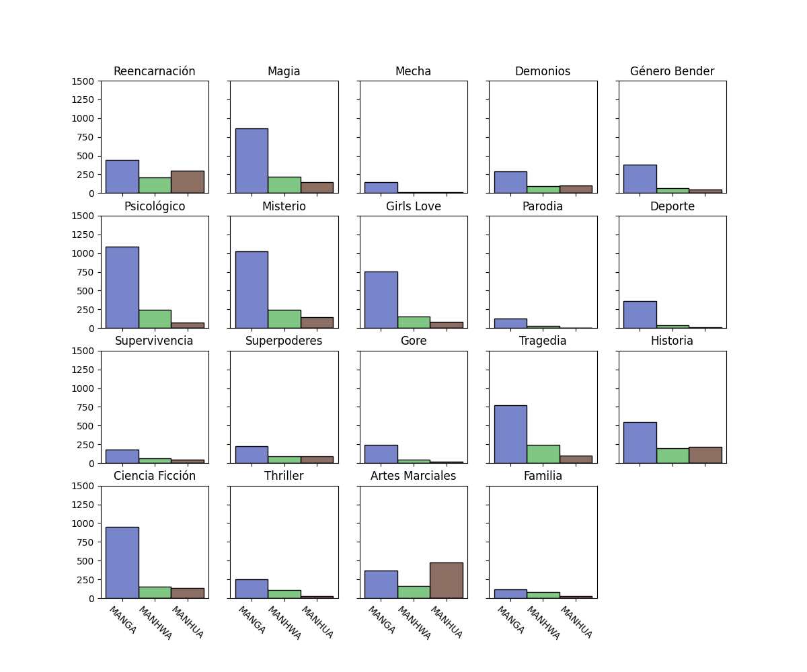

## Presentación sobre el Cómic Asiático en la Comunidad Fansub Hispanohablante

¡Bienvenidos a esta presentación sobre el cómic asiático en la comunidad fansub hispanohablante! En este EDA (Exploratory Data Analysis) vamos a explorar los diferentes tipos de cómics asiáticos y las demografías a las que se dirigen. También proporcionaremos definiciones de algunos términos clave para comprender mejor este fascinante mundo. ¡Comencemos!

### Tipos de Cómics Asiáticos

1. **Manga**: El manga es el término utilizado para referirse a los cómics japoneses. Estos se caracterizan por su estilo artístico distintivo y su lectura de derecha a izquierda. El manga abarca una amplia gama de géneros, incluyendo acción, romance, fantasía, ciencia ficción y muchos más.

2. **Manhwa**: El manhwa es el cómic coreano. Al igual que el manga, se lee de izquierda a derecha, pero suele tener un estilo artístico único. El manhwa también abarca una variedad de géneros, y su popularidad ha ido en aumento en la comunidad fansub hispanohablante.

3. **Manhua**: El manhua es el cómic chino, y se distingue por su estilo y tradición artística propia. A diferencia del manga y el manhwa, el manhua se lee de izquierda a derecha, similar a los cómics occidentales. Los manhua también exploran una amplia gama de géneros y temas.

### Demografías del Cómic Asiático

Las demografías en el cómic asiático se refieren al público objetivo al que están destinados los cómics. Aquí están algunas de las demografías más comunes:

1. **Josei**: Los cómics josei están dirigidos principalmente a mujeres adultas. Suelen abordar temáticas más maduras y realistas, explorando relaciones, vida profesional y otros aspectos de la vida adulta.

2. **Seinen**: El cómic seinen se orienta hacia un público masculino adulto. Se caracteriza por tratar temas más oscuros, maduros y a veces violentos. Los seinen pueden abarcar géneros como la acción, el thriller, el drama y la ciencia ficción.

3. **Shoujo**: Los cómics shoujo están dirigidos principalmente a las chicas adolescentes y jóvenes. Se enfocan en temas románticos, emocionales y de crecimiento personal. El estilo artístico de los shoujo a menudo es delicado y detallado.

4. **Shounen**: El cómic shounen se dirige a un público masculino adolescente y joven. Suelen presentar historias de acción, aventura y superación personal. Los shounen pueden abarcar géneros como el combate, la fantasía y la comedia.

5. **Kodomo**: Los cómics kodomo están dirigidos principalmente a niños pequeños. Estos cómics suelen tener un tono educativo y entretenido, con historias simples y personajes coloridos. Los cómics kodomo pueden abarcar una variedad de géneros, como la comedia y la aventura.

Espero que esta presentación les haya brindado una mejor comprensión de los cómics asiáticos y las dem

ografías a las que se dirigen. ¡Disfruten explorando este fascinante mundo del cómic! Si tienen alguna pregunta, estaré encantado de ayudarles.
 

### Gráfica de Barras: Distribución de Cómics Asiáticos por Tipo

En esta gráfica de barras, hemos representado la distribución de cómics asiáticos según su tipo. Los tipos de cómics incluidos en la gráfica son Manga, Manhwa y Manhua. A continuación, presentamos la gráfica junto con una breve descripción de cada tipo de cómic:

#### Manga
El Manga representa el 71% de los cómics asiáticos en la comunidad fansub hispanohablante. Los mangas son los cómics japoneses, conocidos por su estilo artístico distintivo y su amplia variedad de géneros que van desde acción y romance hasta fantasía y ciencia ficción.

#### Manhwa
El Manhwa ocupa el 17% de los cómics asiáticos en nuestra comunidad. Los manhwas son los cómics coreanos, que han ganado popularidad en los últimos años. Tienen su propio estilo artístico y abarcan una amplia gama de géneros, al igual que los mangas.

#### Manhua
El Manhua representa el 11% de los cómics asiáticos en nuestra comunidad fansub hispanohablante. Los manhuas son los cómics chinos y se caracterizan por su estilo artístico único y su lectura de izquierda a derecha, similar a los cómics occidentales. Al igual que los mangas y los manhwas, los manhuas también exploran una variedad de géneros y temas.

## Explicación de las Demografías en el Cómic Asiático

En el mundo del cómic asiático, existen diversas demografías que están destinadas a diferentes grupos de lectores. Estas demografías se centran en características específicas y se utilizan para orientar el contenido de los cómics hacia audiencias particulares. A continuación, explicaremos las principales demografías del cómic asiático:

### Josei

La demografía Josei se dirige principalmente a mujeres adultas. Los cómics Josei abordan temáticas más maduras y realistas que reflejan la vida y las experiencias de las mujeres adultas. Los temas comunes en los cómics Josei incluyen el amor, las relaciones, la vida profesional, los desafíos personales y el crecimiento emocional. Estos cómics suelen presentar personajes femeninos complejos y profundos, y su estilo artístico puede variar desde lo realista hasta lo estilizado.

### Seinen

El cómic Seinen se orienta hacia un público masculino adulto. Los cómics Seinen suelen tratar temas más oscuros, maduros y a veces violentos. Este género de cómic puede explorar una amplia gama de géneros, como acción, aventura, thriller, ciencia ficción y drama. Los cómics Seinen a menudo se caracterizan por su enfoque realista, tramas complejas y exploración de la psicología de los personajes. También pueden abordar temas sociales y políticos con un nivel de profundidad mayor.

### Shoujo

Los cómics Shoujo están dirigidos principalmente a las chicas adolescentes y jóvenes. Estos cómics se centran en temas románticos, emocionales y de crecimiento personal. Los cómics Shoujo suelen explorar relaciones amorosas, amistad, descubrimiento de la identidad propia, desafíos escolares y superación personal. El estilo artístico de los cómics Shoujo tiende a ser delicado, detallado y con un enfoque en los aspectos estéticos.

### Shounen

La demografía Shounen se dirige a un público masculino adolescente y joven. Los cómics Shounen presentan historias de acción, aventura y superación personal. Estos cómics a menudo siguen a un protagonista masculino que se enfrenta a desafíos y obstáculos, desarrollando habilidades y creciendo tanto física como emocionalmente. Los temas comunes en los cómics Shounen incluyen la amistad, la justicia, el coraje, la competencia y la lucha contra el mal. El estilo artístico puede variar, pero generalmente se caracteriza por ser dinámico y lleno de energía.

### Kodomo

Los cómics Kodomo están destinados principalmente a niños pequeños. Estos cómics tienen un tono educativo y entretenido, y suelen presentar historias simples y personajes coloridos. Los cómics Kodomo pueden abordar una variedad de temas, como aventuras imaginativas, amistad, aprendizaje y valores morales. El estilo artístico de los cómics Kodomo suele ser más accesible y adaptado a la comprensión de los niños.

Estas demografías del cómic asiático proporcionan una guía para que los lectores encuentren có

mics que se ajusten a sus preferencias y grupos de edad. Cada demografía tiene su propio estilo, temáticas y enfoque, lo que brinda una amplia variedad de opciones para los amantes del cómic.

## Introducción a los Géneros más Populares del Cómic Asiático

El cómic asiático, ya sea el manga japonés, el manhwa coreano o el manhua chino, abarca una amplia variedad de géneros que se adaptan a los gustos e intereses de diferentes lectores. Estos géneros exploran una amplia gama de temas, desde la acción y la aventura hasta el romance y la fantasía. A continuación, presentaremos una introducción a algunos de los géneros más populares del cómic asiático:

### Acción y Aventura

El género de acción y aventura es uno de los más populares en el cómic asiático. Estos cómics están llenos de emocionantes escenas de combate, persecuciones y hazañas heroicas. Los protagonistas suelen embarcarse en misiones peligrosas, luchar contra villanos poderosos y enfrentar desafíos épicos. Este género es conocido por su ritmo rápido, su suspenso y su capacidad para mantener a los lectores al borde de sus asientos.

### Romance

El romance es un género atemporal que atrae a una amplia audiencia. Los cómics asiáticos exploran el romance de manera tierna, emotiva y a veces humorística. Estos cómics pueden centrarse en la construcción de relaciones amorosas, los desafíos y obstáculos que enfrentan las parejas y la evolución de los sentimientos. El romance puede presentarse en una variedad de ambientaciones, como la escuela, el trabajo, la fantasía o incluso en situaciones cotidianas.

### Fantasía

El género de fantasía es apreciado por su capacidad para transportar a los lectores a mundos imaginarios y llenos de maravillas. Los cómics de fantasía presentan elementos mágicos, criaturas sobrenaturales y aventuras épicas. Pueden explorar temas como la lucha entre el bien y el mal, el descubrimiento de poderes ocultos, la búsqueda de tesoros legendarios y la conquista de reinos fantásticos. Este género permite a los lectores sumergirse en emocionantes y vibrantes universos.

### Ciencia Ficción

La ciencia ficción es un género que fusiona elementos científicos y tecnológicos con la imaginación. Los cómics asiáticos de ciencia ficción exploran futuros distópicos, viajes en el tiempo, tecnologías avanzadas y encuentros con seres extraterrestres. Este género plantea preguntas sobre el futuro de la humanidad, las consecuencias de la tecnología y los límites de la exploración espacial. Los cómics de ciencia ficción a menudo presentan conceptos innovadores y visiones creativas del futuro.

### Comedia

La comedia es un género apreciado por su capacidad para hacer reír y entretener a los lectores. Los cómics asiáticos de comedia presentan situaciones humorísticas, diálogos ingeniosos y personajes caricaturescos. Pueden abarcar desde la comedia romántica hasta la comedia de situación, pasando por la comedia de enredos y la comedia absurda. La comedia en el cómic asiático puede ser tanto ligera y divertida como satírica y sarcástica.

Estos son solo algunos de los géneros más populares en el cómic asiático. Cada uno de ellos ofrece una experiencia de lectura única y emocionante, atrayendo a lectores de todas las edades y gustos. Explorar los diversos géneros del cómic asiático es una forma de sumergirse en historias fascinantes y descubrir nuevos mundos llenos de imaginación y emoción.

## Introducción a las Gráficas de Opinión sobre el Cómic Asiático en la Comunidad Hispanohablante

En esta presentación, analizaremos las opiniones de la comunidad hispanohablante sobre el cómic asiático. Para ello, hemos recopilado datos en varios campos de opinión, que incluyen: 'score', 'read' (leído), 'pending' (pendiente de lectura), 'following' (siguiendo), 'favorite' (favorito), 'have' (tener) y 'abandoned' (abandonado). Estas gráficas nos permitirán entender mejor cómo percibe la comunidad hispanohablante el cómic asiático y qué obras son las más apreciadas. ¡Comencemos!

### Gráficas de Opinión sobre el Cómic Asiático

Hemos representado los datos recolectados en una serie de gráficas para visualizar la opinión de la comunidad hispanohablante. A continuación, presentamos una descripción de cada campo de opinión y cómo se reflejan en las gráficas:

- **Score**: Esta gráfica muestra la calificación promedio otorgada por los lectores a los cómics asiáticos. Nos dará una idea de la satisfacción general de la comunidad y cómo valoran las obras en general.

- **Read**: En esta gráfica, veremos la cantidad de cómics asiáticos que los lectores hispanohablantes han leído. Esto nos permitirá identificar las obras más populares y cómo se distribuye el interés de lectura en la comunidad.

- **Pending**: Esta gráfica mostrará cuántos cómics asiáticos están pendientes de lectura por parte de la comunidad hispanohablante. Nos ayudará a entender qué obras generan expectativas y cuáles están en la lista de deseos de los lectores.

- **Following**: Aquí veremos cuántos lectores hispanohablantes siguen activamente las obras de cómic asiático. Esto nos indicará cuáles son los títulos más seguidos y populares dentro de la comunidad.

- **Favorite**: Esta gráfica nos mostrará los cómics asiáticos que han sido marcados como favoritos por los lectores hispanohablantes. Nos dará una visión clara de las obras más apreciadas y que han dejado una impresión duradera en la comunidad.

- **Have**: En esta gráfica, exploraremos cuántos lectores hispanohablantes poseen copias físicas o digitales de cómics asiáticos. Nos permitirá conocer el nivel de adquisición y posesión de estas obras entre los lectores.

- **Abandoned**: Por último, esta gráfica nos mostrará la cantidad de cómics asiáticos que los lectores hispanohablantes han abandonado sin completar. Nos ayudará a comprender qué factores pueden influir en la falta de interés o la insatisfacción con ciertas obras.

### Conclusiones

A través de estas gráficas de opinión, podremos tener una visión más clara de cómo la comunidad hispanohablante percibe el cómic asiático. Podremos identificar las obras más populares, las preferencias de lectura y los cómics que generan mayor interés y satisfacción. Estos datos nos brindarán información valiosa sobre las preferencias de la comunidad y nos ayudarán a comprender mejor el impacto del cómic asiático en la audiencia hispanohablante. ¡Analicemos ahora las gráficas y saquemos conclusiones interesantes!

## Descripción de la Gráfica de Correlación

En esta sección, analizaremos una gráfica de correlación que muestra la relación entre los distintos valores recopilados: 'score', 'read', 'pending', 'following', 'favorite', 'have' y 'abandoned'. Esta gráfica nos ayudará a comprender cómo se relacionan estos valores entre sí y si existe alguna asociación significativa entre ellos.

La gráfica de correlación nos permitirá visualizar la fuerza y la dirección de la relación entre los distintos valores. Cada punto en la gráfica representa una combinación de dos valores y su ubicación en el gráfico indica el grado de relación entre ellos. A continuación, describiremos brevemente lo que podemos inferir de esta gráfica:

A través de esta gráfica de correlación, podremos identificar posibles patrones o tendencias entre los valores recopilados. Esto nos ayudará a comprender mejor la relación entre ellos y a obtener información valiosa sobre cómo los diferentes aspectos influyen en la opinión y las preferencias de la comunidad hispanohablante sobre el cómic asiático.

## Conclusiones sobre la Evolución del Cómic Asiático en la Comunidad Hispanohablante en la Última Década

En la última década, el cómic asiático ha experimentado una notable evolución y crecimiento en la comunidad hispanohablante. A través de los avances tecnológicos y la mayor accesibilidad a obras de diferentes países asiáticos, los lectores hispanohablantes han ampliado su interés y participación en este género. A continuación, se presentan algunas conclusiones destacadas sobre la evolución del cómic asiático en la comunidad hispanohablante:

1. **Aumento en la popularidad**: El cómic asiático ha ganado una creciente popularidad en la comunidad hispanohablante en los últimos años. Los lectores han descubierto la diversidad de géneros, temáticas y estilos que ofrece el cómic asiático, y esto ha generado un aumento en el interés y la participación de los lectores.

2. **Mayor diversidad de géneros y demografías**: La comunidad hispanohablante ha experimentado una mayor exposición y apreciación por una amplia gama de géneros y demografías del cómic asiático. Desde el shounen y el shoujo hasta el seinen y el josei, los lectores hispanohablantes han tenido la oportunidad de explorar obras que se adaptan a sus intereses y preferencias.

3. **Mayor accesibilidad**: La accesibilidad a los cómics asiáticos ha mejorado significativamente en la última década. La disponibilidad de traducciones oficiales, publicaciones digitales y plataformas de lectura en línea ha facilitado que los lectores hispanohablantes puedan acceder a una amplia variedad de obras asiáticas, rompiendo las barreras del idioma y la distancia geográfica.

4. **Crecimiento de la comunidad de fansub**: La comunidad de fansub hispanohablante ha desempeñado un papel crucial en la difusión y promoción del cómic asiático. Los fansubs han trabajado arduamente para traducir y compartir obras de cómic asiático, permitiendo que un público más amplio tenga acceso a estas obras y fomentando el crecimiento de la comunidad de lectores.

5. **Interacción en línea y redes sociales**: Las redes sociales y las plataformas en línea han jugado un papel fundamental en la evolución del cómic asiático en la comunidad hispanohablante. Los lectores han utilizado estas plataformas para discutir, recomendar y compartir sus experiencias con el cómic asiático, creando comunidades en línea que han fortalecido aún más el interés y la difusión de este género.

En resumen, el cómic asiático ha experimentado un crecimiento significativo en la comunidad hispanohablante en la última década. La diversidad de géneros, la mayor accesibilidad y la interacción en línea han contribuido a un mayor interés y participación de los lectores hispanohablantes en este género. Este crecimiento continuo sugiere un futuro prometedor para el cómic asiático en la comunidad hispanohablante, con más obras emocionantes y una base de lectores en constante expansión.